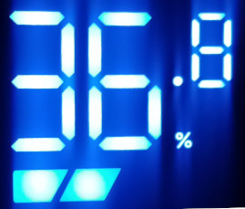
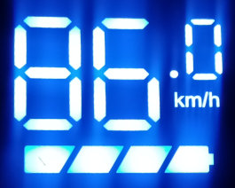

## Lime Scooter Display

UART API for LimeS. Make the screen say whatever you want that is possible over serial interface.
Can be used to indicate percentage or speed.
Cover the battery, logo and percent symbol to use as a generic display for values 00.0 -> 99.9.
Runs off 7-80Vdc. Logic level 5V.

